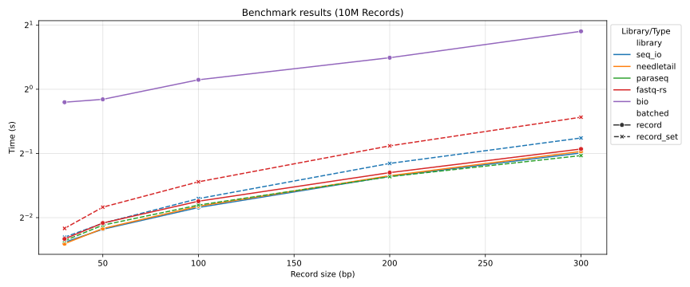

# paraseq benchmark

This is a benchmark of different FASTQ parsers in rust.
It is not meant to be an exhaustive benchmark, but rather a simple comparison of the speed of different parsing strategies.

Mainly:
1. Copying
2. Zero-copy
3. Minimal-copy parsing

The libraries tested are:

| Library | Sequential Processing Strategy | Parallel Processing Strategy |
|---------|--------------------------------|------------------------------|
| [bio](https://crates.io/crates/bio) | Copying | N/A |
| [fastq-rs](https://crates.io/crates/fastq-rs) | Zero-copy | One-copy |
| [seq_io](https://crates.io/crates/seq_io) | Zero-copy | One-copy |
| [needletail](https://crates.io/crates/needletail) | Zero-copy | N/A |
| [paraseq](https://crates.io/crates/paraseq) | Minimal-copy | Minimal-copy |

The benchmark is done on files of the same number of records but with each file having a different record length.

## Benchmarking

This benchmark was taken on my local computer using a AMD Ryzen 7 7700X and an NVMe SSD.




## Running the benchmark

To run the benchmark you will need to have the following installed:

1. [Rust](https://www.rust-lang.org/tools/install)
2. [Hyperfine](https://crates.io/crates/hyperfine)
3. [Just](https://crates.io/crates/just)
4. [Nucgen](https://crates.io/crates/nucgen)

Then you can install the benchmarking tool by cloning the repository and running:

```bash
cargo install --path .

# Check that the tool is installed
psb --version
```

Then you can run the benchmark by running:

```bash
# Generate the nucleotide data
just gen_data

# Run the benchmark
just run_benchmarks
```
